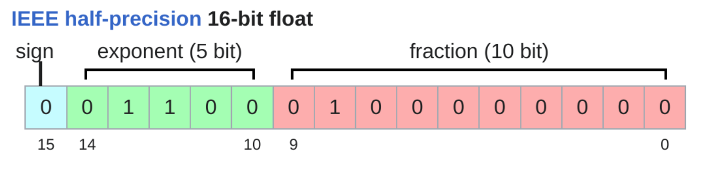
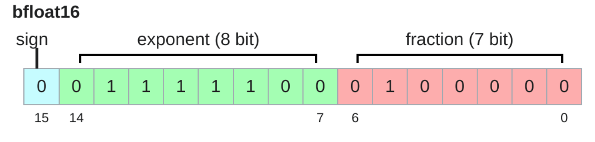
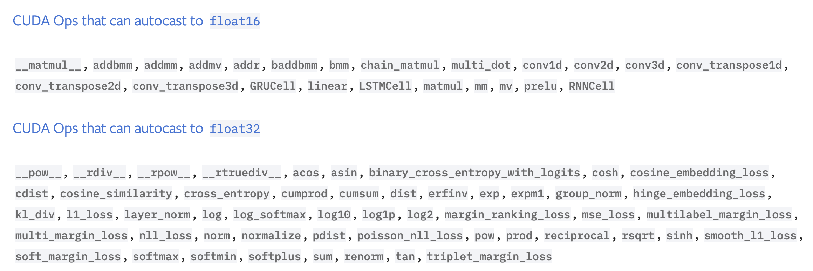

# rule of thumb

Always use the power of 2 for setting things.


# torch.compile

`torch.compile` will compile the model and make it faster.

```python
model = torch.compile(model)
```

# Mixed precision
## basic
`x.numel()` will return the total number of elements in `x`

`x.element_size()` will return the size in byte for single element in `x`

`x.numel() * x.element_size()` returns the total size of `x` in byte.

### Floating points
#### fp32
In Pytorch `float32` is the default data type, which is usually more than enough for deep learning.
For `float32`, it has 32 bits, 4 bytes. 

#### fp16
`float16` has a small dynamics range, which results in numbers like `1e-8` round to 0.
`bfloat16` addresses this issue, it has the same dynamics range as `float32`.

<div align="center">

</div>

<div align="center">

</div>

```python
x = torch.tensor([1e-8], dtype = torch.float16)
>>> x
    tensor([0.], dtype=torch.float16)

x = torch.tensor([1e-8], dtype = torch.bfloat16)
>>> x
    tensor([1.0012e-08], dtype=torch.bfloat16)
```

## torch.autocast
In the forward pass usually not all operation require full precision (fp32), some of them will be just fine with fp16.

To use mixed precision in Pytorch, `torch.autocast` is the default choice. 
It will automatically cast operations into lower precision when it see fits.

<div align="center">

</div>


```python
# Creates model and optimizer in default precision
model = Net().cuda()
optimizer = optim.SGD(model.parameters(), ...)

for input, target in data:
    optimizer.zero_grad()

    # Enables autocasting for the forward pass (model + loss)
    with torch.autocast(device_type="cuda", dtype=torch.bfloat16):
        output = model(input)
        loss = loss_fn(output, target)

    # Exits the context manager before backward()
    loss.backward()
    optimizer.step()
```


