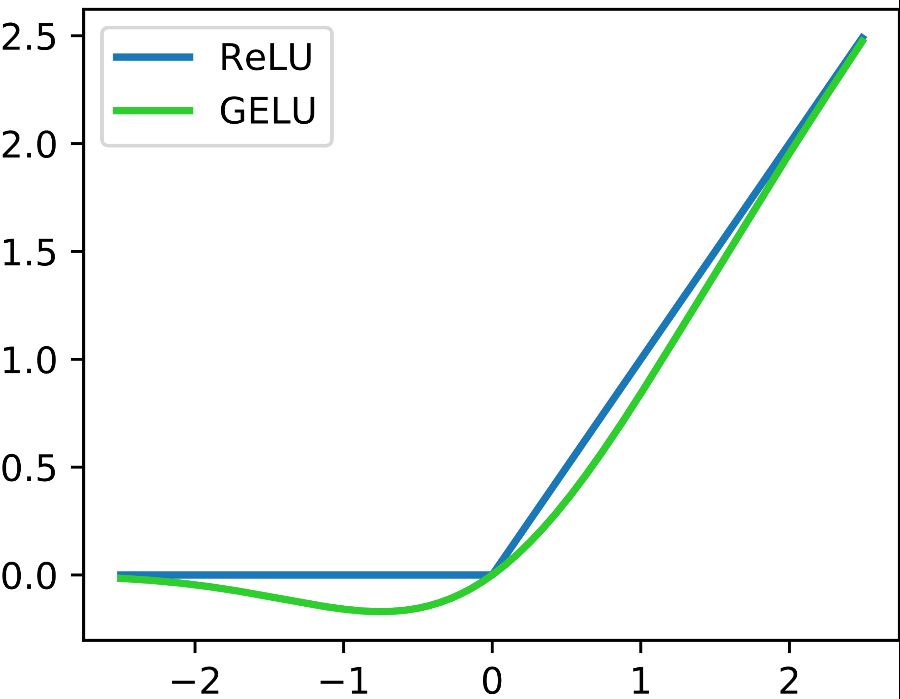

# Architecture

## Pre vs Post Norm

Pre-norm: normalise before function
```python
x = x + self.attn(self.ln_1(x))
x = x + self.mlp(self.ln_2(x))
```

Post-norm: normalise after function
```python
x = x + self.ln_1(self.attn(x))
x = x + self.ln_2(self.mlp(x))
```

Nowadays pre-norm is the most common choice. It is more stable to train.

## LayerNorm vs RMSNorm

LayerNorm: $y=\frac{x-\mathrm{E}[x]}{\sqrt{\text{Var}[x]+\epsilon}} * \gamma+\beta$

RMSNorm: $y=\frac{x}{\sqrt{||x||_2^2+\epsilon}} * \gamma$

RMSNorm has 
- fewer operations (no mean calculation)
- fewer parameters (no bias term)

It runs faster and gives the same performance.

## bias term in MLP

Most modern NN drops the bias term in MLP to reduce memory and improve optimization stability.

## Activation functions

### ReLU and GeLU
ReLU: $f(x) = \text{max}(0, x)$

GeLU: $f(x) = x \Phi(x)$, $\Phi(x)$ is the CDF of Gaussian

<div align="center">

</div>

### GLU (Gated activations)

Vanilla MLP in transformer has the path
```python
x = activation(fc1(x))
x = fc2(x)
```

GLU and its variants changes `x = activation(fc1(x))`
$$
\text{activation(fc1(}x\text{))} = \text{activation}(x\textcolor{green}{W})
$$
into
$$
\text{GLU}(x, \textcolor{green}{W}, \textcolor{blue}{V}) = \sigma(x\textcolor{green}{W}) \odot (x\textcolor{blue}{V})
$$

$$
\text{GeGLU}(x, \textcolor{green}{W}, \textcolor{blue}{V}) = \text{GELU}(x\textcolor{green}{W}) \odot (x\textcolor{blue}{V})
$$

$$
\text{SwiGLU}(x, \textcolor{green}{W}, \textcolor{blue}{V}) = \text{Swish}_1(x\textcolor{green}{W}) \odot (x\textcolor{blue}{V})
$$
where $\text{Swish}_\beta(x)=x \sigma(\beta x)$. 

We can consider $\textcolor{green}{W}$ as the weights for the org linear layer, and $\textcolor{blue}{V}$ as the extra parameter from the activation function

## serial vs parallel layers

Normally transformer blocks are serial:
$$
y=x+\text{MLP}(\text{LN}(x+\text{Attention}(\text{LN}(x)))
$$

Parallel layers do this in parallel:
$$
y=x+\text{MLP}(\text{LN}(x))+\text{Attention}(\text{LN}(x))
$$


## Position embedding

RoPE
