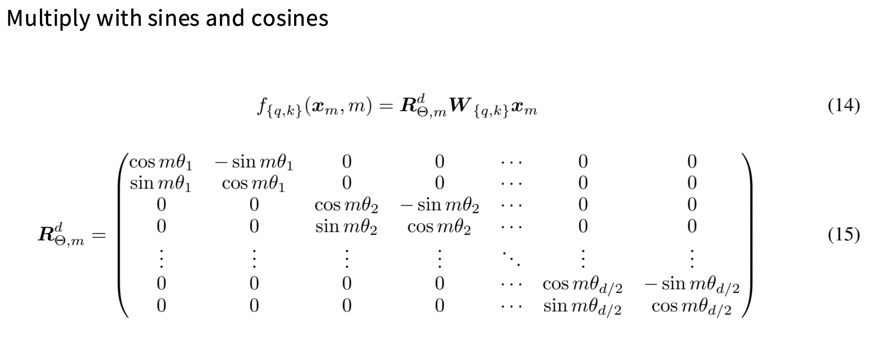
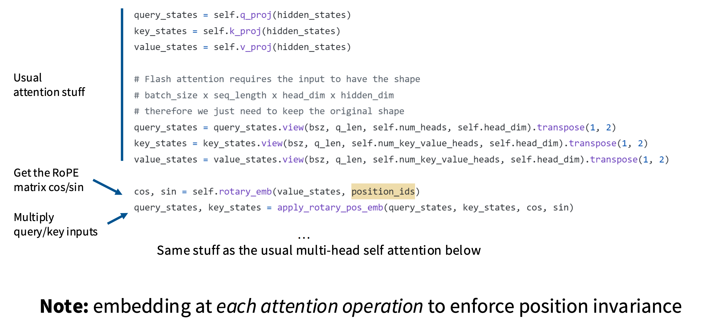
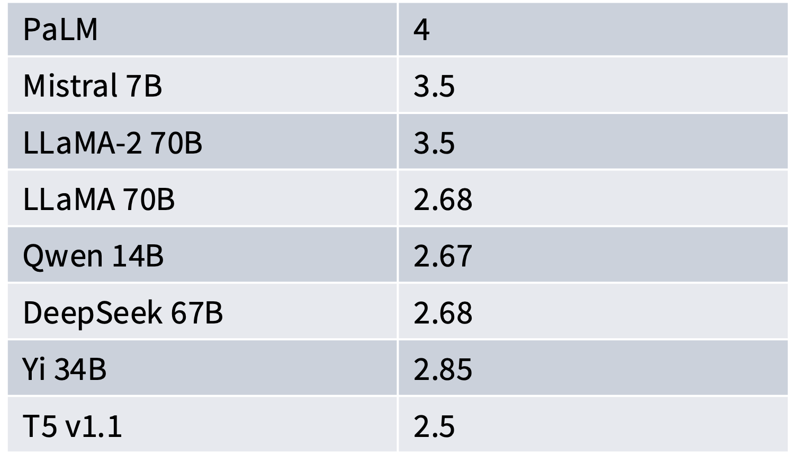
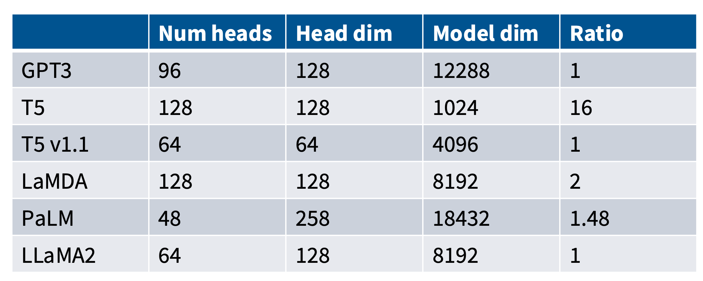
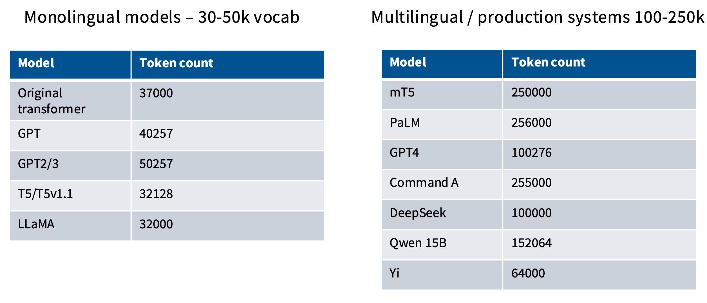
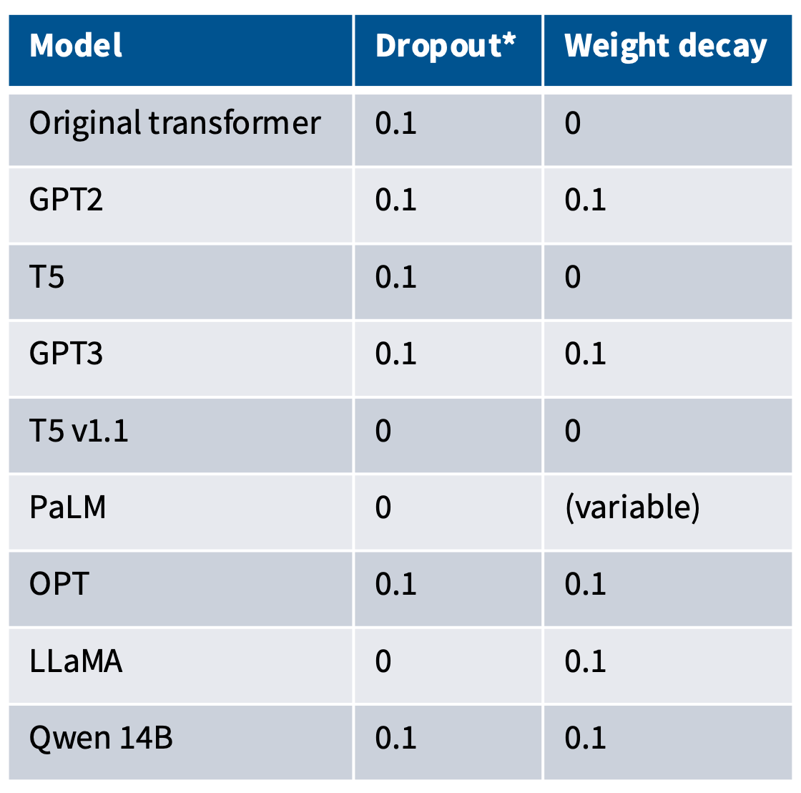

# Architecture

## Pre vs Post Norm

Pre-norm: normalise before function
```python
x = x + self.attn(self.ln_1(x))
x = x + self.mlp(self.ln_2(x))
```

Post-norm: normalise after function
```python
x = x + self.ln_1(self.attn(x))
x = x + self.ln_2(self.mlp(x))
```

Nowadays pre-norm is the most common choice. It is more stable to train.

## LayerNorm vs RMSNorm

LayerNorm: $y=\frac{x-\mathrm{E}[x]}{\sqrt{\text{Var}[x]+\epsilon}} * \gamma+\beta$

RMSNorm: $y=\frac{x}{\sqrt{||x||_2^2+\epsilon}} * \gamma$

RMSNorm has 
- fewer operations (no mean calculation)
- fewer parameters (no bias term)

It runs faster and gives the same performance.

## bias term in MLP

Most modern NN drops the bias term in MLP to reduce memory and improve optimization stability.

## Activation functions

### ReLU and GeLU
ReLU: $f(x) = \text{max}(0, x)$

GeLU: $f(x) = x \Phi(x)$, $\Phi(x)$ is the CDF of Gaussian

<div align="center">

</div>

### GLU (Gated activations)

Vanilla MLP in transformer has the path
```python
x = activation(fc1(x))
x = fc2(x)
```

GLU and its variants changes `x = activation(fc1(x))`

$$
\text{activation(fc1(}x\text{))} = \text{activation}(x\textcolor{green}{W})
$$

into

$$
\text{GLU}(x, \textcolor{green}{W}, \textcolor{blue}{V}) = \sigma(x\textcolor{green}{W}) \odot (x\textcolor{blue}{V})
$$

$$
\text{GeGLU}(x, \textcolor{green}{W}, \textcolor{blue}{V}) = \text{GELU}(x\textcolor{green}{W}) \odot (x\textcolor{blue}{V})
$$

$$
\text{SwiGLU}(x, \textcolor{green}{W}, \textcolor{blue}{V}) = \text{Swish}_1(x\textcolor{green}{W}) \odot (x\textcolor{blue}{V})
$$

where $\text{Swish}_\beta(x)=x \sigma(\beta x)$. 

We can consider $\textcolor{green}{W}$ as the weights for the org linear layer, and $\textcolor{blue}{V}$ as the extra parameter from the activation function.

All GLU variants are scaled by $\frac23$ to preserve the variance across layers.

## serial vs parallel layers

Normally transformer blocks are serial:

$$
y=x+\text{MLP}(\text{LN}(x+\text{Attention}(\text{LN}(x)))
$$

Parallel layers do this in parallel:

$$
y=x+\text{MLP}(\text{LN}(x))+\text{Attention}(\text{LN}(x))
$$


## Position embedding RoPE

### once vs all time
In vanilla position embedding, it adds a vector at the beginning of the NN once and for all. 

If we look at the computation in transformer, the position only matters in the attention score computation.
So RoPE encode position into query and key vector.

### relative position

Another thing RoPE did is encode the relative position. 
Since attention score uses inner product, the position embedidng needs to be encode in a way that only relative position will matter.
Here it uses rotation.

Becuase rotation in higher dimension than 2D is not determinstic, it does a funky thing to split query vector in a bunch of 2D pairs, and then rotate them each.

The math and code looks like this
<div align="center">

</div>

<div align="center">

</div>


# Degisn choice / Hyperparameters

## How much bigger should the MLP expansion be?

$d_{\text{fc}} =4 d_{\text{hidden}}$ is usually the case. 

<div align="center">

</div>

## Does hidden dim / num heads must be an integral?
Model dim refers to the embedding dimension. 

Ratio is (num head * head dim) / embedding dimension 

<div align="center">

</div>

## What should be the vocab size?
Monolingual vocab doesn't need to be huge, but multilingual ones do.

<div align="center">

</div>

## Do we need regularization during pretraining?

Pre-training usually only do one epoch because of the huge size of training data.

- There is a lot of data (trillions of tokens), more than parameters.
- SGD only does a single pass on a corpus (hard to memorize)

But in practice, 

<div align="center">

</div>

It turns out that weight decay is somehow intertangled with the learning rate scheduler. 
So it's not about regularisation, but about optimisation.
