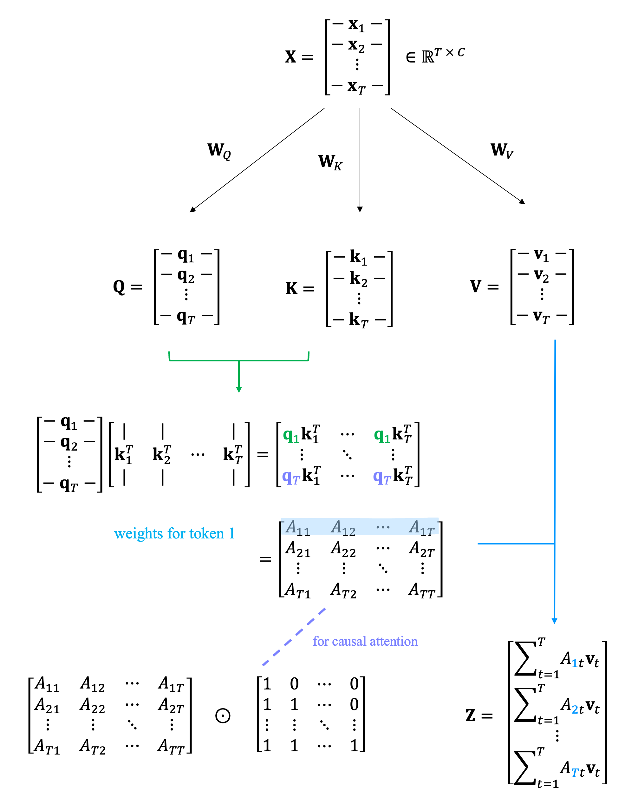

# Component
## self-attention

<div align="center">

</div>

We can write self-attention as

$$\text{Attn}(\mathbf{Q}, \mathbf{K}, \mathbf{V}) = \text{softmax}(\frac{\mathbf{Q}\mathbf{K}^{\top}}{\sqrt{d_k}}) \mathbf{V}$$

where
$$\mathbf{Q} \in \mathbb{R}^{T \times C}, \mathbf{K} \in \mathbb{R}^{T \times C}, \mathbf{V} \in \mathbb{R}^{T \times C}$$


Divide by $\sqrt{d_k}$ is to make sure we don't get overly sharp attention score after softmax. 
If we assume each feature dimension of $\mathbf{q}$ and $\mathbf{k}$ is univariate Gaussian.  
If we make this assumption

> Let $X, Y$ be uncorrelated random variables with means $\mu_X, \mu_Y$, and variances $\sigma_X^2, \sigma_Y^2$. If, additionally, the random variables $X^2$ and $Y^2$ are uncorrelated, then the variance of the product $XY$ is
>$$\text{Var}(X Y)=\left(\sigma_X^2+\mu_X^2\right)\left(\sigma_Y^2+\mu_Y^2\right)-\mu_X^2 \mu_Y^2$$

We have 
$$\text{Var}[\mathbf{q}\mathbf{k}^{\top}] = \text{Var}\left[\sum_{d=1}^{d_k}q_dk_d\right] = \sum_{d=1}^{d_k}\text{Var}[q_dk_d] = d_k$$

$$\text{Var}\left[\frac{\mathbf{q}\mathbf{k}^{\top}}{\sqrt{d_k}}\right] = 1$$


Note that

- Attention doesn't have any direction

- In practice attention is implemented over batch. Since the operation is broadcasted over batch, tokens from different batches never communicate


## residual connection

TODO

- deep neural network suffers from optimisation, residual connection helps
- gradient distribution evenly over sum, then residual connection provides a fast flow from target to inputs


In the original 'Attention is all you need paper', they do post-LN
```python
x = x + self.ln_1(self.attn(x))
x = x + self.ln_2(self.mlp(x))
```

In GPT-2 code, they change it into pre-LN
```python
x = x + self.attn(self.ln_1(x))
x = x + self.mlp(self.ln_2(x))
```

For some reason pre-LN allows better gradient flows in very deep stacks.

## layer normalisation
TODO

# Structure

## encoder, decoder, encoder & decoder transformer

### Encoder (BERT, RoBERTa)
The goal is to encode/understand the input text, uses bidirectional self-attention.

```css
[Input] ──► [Encoder Stack] ──► [Output embeddings or classification]
```

BERT is being trained with Masked Language Modeling (MLM) and Next Sentence Prediction (NSP).
In MLM, tokens are randomly masked

```The quick [MASK] fox jumps over the [MASK] dog```

and the network needs to predict these masked tokens.


### Decoder (GPT, Llama, ...)
The goal is to generate text, uses causal (masked) self-attention

```css
[Context] ──► [Decoder Stack] ──► [Next-token logits]
```

### Encoder & Decoder (T5, BART)

The goal is to map one sequence to another (translation, summarization, etc), uses cross-attention

```css
[Input] ──► [Encoder] ──► Context
                         │
[Generated tokens so far] ──► [Decoder] ──► [Next token]
```
