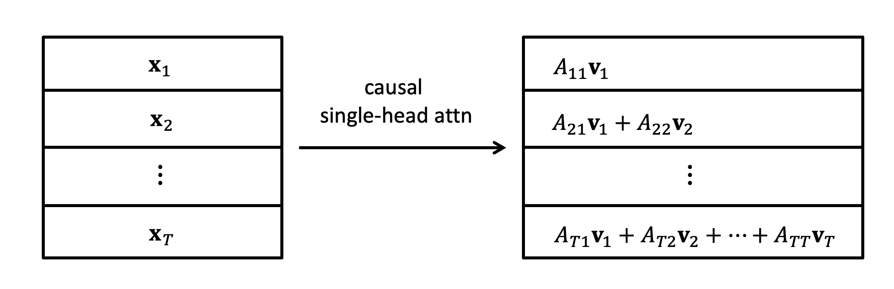
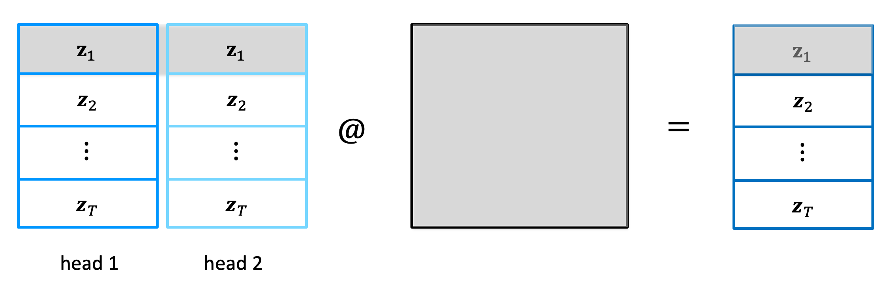

# Component
## self-attention

### single-head
<div align="center">

</div>

We can write self-attention as

$$\text{Attn}(\mathbf{Q}, \mathbf{K}, \mathbf{V}) = \text{softmax}(\frac{\mathbf{Q}\mathbf{K}^{\top}}{\sqrt{d_k}}) \mathbf{V}$$

where
$$\mathbf{Q} \in \mathbb{R}^{T \times C}, \mathbf{K} \in \mathbb{R}^{T \times C}, \mathbf{V} \in \mathbb{R}^{T \times C}$$

In each single head, if using causal masking, `emb[t]` will only have information from `x[1:t]`:
<div align="center">

</div>

#### divided by $\sqrt{d_k}$
This is to make sure we don't get overly sharp attention score after softmax. 
If we assume each feature dimension of $\mathbf{q}$ and $\mathbf{k}$ is univariate Gaussian.  
If we make this assumption

> Let $X, Y$ be uncorrelated random variables with means $\mu_X, \mu_Y$, and variances $\sigma_X^2, \sigma_Y^2$. If, additionally, the random variables $X^2$ and $Y^2$ are uncorrelated, then the variance of the product $XY$ is
>$$\text{Var}(X Y)=\left(\sigma_X^2+\mu_X^2\right)\left(\sigma_Y^2+\mu_Y^2\right)-\mu_X^2 \mu_Y^2$$

We have 
$$\text{Var}[\mathbf{q}\mathbf{k}^{\top}] = \text{Var}\left[\sum_{d=1}^{d_k}q_dk_d\right] = \sum_{d=1}^{d_k}\text{Var}[q_dk_d] = d_k$$

$$\text{Var}\left[\frac{\mathbf{q}\mathbf{k}^{\top}}{\sqrt{d_k}}\right] = 1$$

### multi-head


In multi-head attention, $\text{softmax}(\frac{\mathbf{Q}\mathbf{K}^{\top}}{\sqrt{d_k}}) \mathbf{V}$ from different attention heads are concatenated together and then fused. 
This is done so that tokens from different time steps never communicate with each other:

<div align="center">

</div>

## efficient causal training 

Attention is designed so that futher information never flows into the past.
As MLP is applied per token independently, in the end after passing through the whole transformer, `emb[t]` will only have information from `x[1:t]`.

Because of this, an input sequence with length $T$ corresponds to $T$ prediction tasks in the end, i.e., if we denote $f(x_{1:T})$ as the output of the transformer, then, $f(x_{1:T})[t]$ will be the prediction for the next token for $x[1:t]$. 


## residual connection

- deep neural network suffers from optimisation, residual connection helps
- gradient distribution evenly over sum, then residual connection provides a fast flow from target to inputs


In the original 'Attention is all you need paper', they do post-LN
```python
x = x + self.ln_1(self.attn(x))
x = x + self.ln_2(self.mlp(x))
```

In GPT-2 code, they change it into pre-LN
```python
x = x + self.attn(self.ln_1(x))
x = x + self.mlp(self.ln_2(x))
```

TODO: pre-LN allows better gradient flows in very deep neural networks for some reason. 

## layer normalisation

For causal attention we don't want information to flow from future token to the past token, so layer norm is a better choice.
It basically do the normalisation on each token independently.

# Structure

## encoder, decoder, encoder & decoder transformer

### Encoder (BERT, RoBERTa)
The goal is to encode/understand the input text, uses bidirectional self-attention.

```css
[Input] ──► [Encoder Stack] ──► [Output embeddings or classification]
```

BERT is being trained with Masked Language Modeling (MLM) and Next Sentence Prediction (NSP).
In MLM, tokens are randomly masked

```The quick [MASK] fox jumps over the [MASK] dog```

and the network needs to predict these masked tokens.


### Decoder (GPT, Llama, ...)
The goal is to generate text, uses causal (masked) self-attention

```css
[Context] ──► [Decoder Stack] ──► [Next-token logits]
```

### Encoder & Decoder (T5, BART)

The goal is to map one sequence to another (translation, summarization, etc), uses cross-attention

```css
[Input] ──► [Encoder] ──► Context
                         │
[Generated tokens so far] ──► [Decoder] ──► [Next token]
```

# Training details
Simple training loop
```python
optimizer = torch.optim.AdamW(model.parameters(), lr = 3e-4, weight_decay = 1e-3)
for i in range(50):
    optimizer.zero_grad()
    
    logits, loss = model(x, y)
    loss.backward()    
    optimizer.step()
    
    print(f"step {i}, loss {loss.item()}")
```

with gradient clipping, learning rate schedule, correct weight decay and gradient accumulation

```python
optimizer = model.configure_optimizers(weight_decay, lr, device) # only decay 2D parameters

for cur_step in range(max_steps):
    optimizer.zero_grad()
    
    loss_accum = 0.0
    # gradeint accumulation
    for micro_step in range(grad_accum_steps):
        # mixed precision
        with torch.autocast(device_type = device, dtype = torch.bfloat16):
            logits, loss = model(x, y)
        loss = loss / grad_accum_steps  # CE average over the number of batch
        loss_accum += loss.detach()
        loss.backward()    
    # gradient clip
    norm = torch.nn.utils.clip_grad_norm_(model.parameters(), 1.0)
    # learning rate schedule
    lr = get_lr(cur_step)
    for param_group in optimizer.param_groups:
        param_group['lr'] = lr
    optimizer.step()
    
    print(f"step {cur_step:4d} | loss {loss_accum.item():.6f} | norm: {norm:.4f}")

```

## auto-casting

Some computations in forward pass don't require full precision (fp32). `torch.autocast` will compute the one with lower precision automatically.

## gradient clipping

Graident is clipped to have a maximum norm to decrease the influence of bad batches.

## learning rate schedule

Warm up + learning rate decay

## weight decay

For some reason, one dimension tensors (like bias, layer norm) are usually not weight decayed.

## gradient accumulation

When we can't fit a huge batch size on to GPU, we can use gradient accumulation to achieve this with multiple smaller batches.

Here the idea is, in the loss the default reduction is `mean`, which is calculated over each single batch.

The gradeint for a batch size $M$ is then computed on $\frac{1}{M} \sum_{i=1}^M \ell_i$, where $\ell_i$ is the loss for data point $i$.

If we split this into, say, 3 smaller batches. Then for each batch, the gradient is computed over $\frac{1}{M/3} \sum_{i=1}^{M/3} \ell_i = \frac{3}{M}\sum_{i=1}^{M/3} \ell_i$. 
In Pytorch the gradient is summed over together, thus, if we call `loss.grad()` four times, the current gradients stored would be
$$\frac{3}{M}\sum_{i=1}^{M/3} \ell_i + \frac{3}{M}\sum_{i=1}^{M/4} \ell_i + \frac{3}{M}\sum_{i=1}^{M/3} \ell_i = \frac{3}{M}\sum_{i=1}^{M} \ell_i$$

To get the correct gradient, we need to divide this by 3. 


