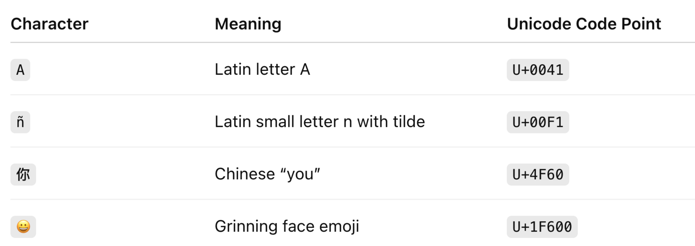
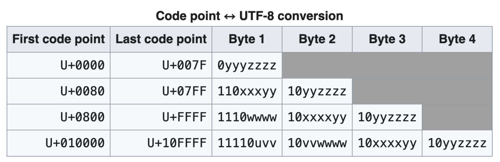
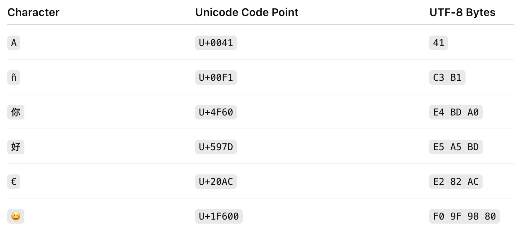
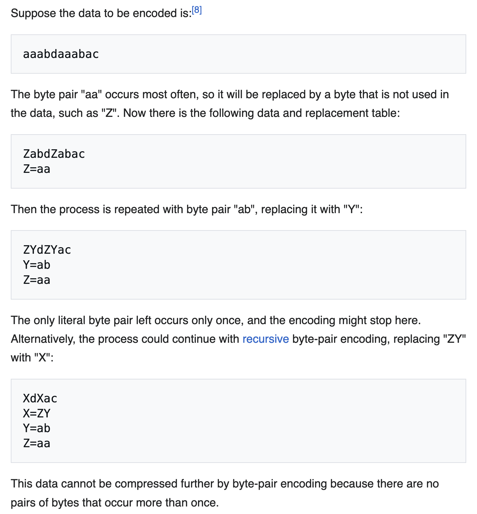
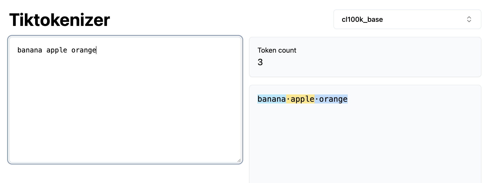
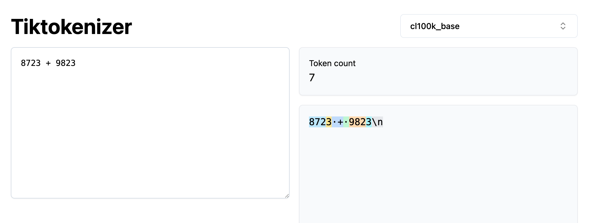
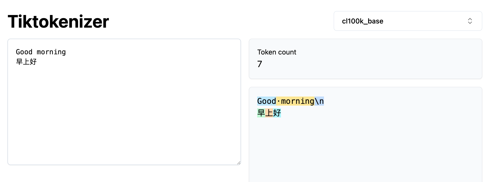

# Background

## Bits, Bytes

A bit can only be 0 or 1

A byte is consisted of eight bits, which corresponds to $2^8 = 256$ values

```
00000000 --> value 0
11111111 --> value 255
```

## Unicode

`character → hex rep`

Unicode maps a character into a number in hexadecimal, which is called Unicode Code Point 

<div align="center">

</div>

## UTF-8
`character → byte rep`

A byte can take 256 different values, so it can also be used as a code. 
In UTF-8, a character is first mapped into a number in hex by Unicode, then, we map it into the byte representation.

<div align="center">

</div>

 <br>
  <br>

<div align="center">

</div>


# Tokenisation

## character, word, subword

### Character level 
Treats each character as a token.

Downside
- The vocabulary size depends on the language's alphabet.
- We will usually end up with a very long input

Upside
- We will never run into out of vocabulary

### Word level 
Treats each word as a token.

Downside
- Unbounded vocabulary size

Upside
- Short input
- Each single unit is something sensible

### Subword
Here we usually learn the subword from a given corpus.

Downside
- Might learn different representations for the same thing, `cat`, `Cat`, `Cat.`, `cat!` might end up have their own representation
- Might break a word in strange ways

Upside
- Won't encounter out of vocab issue
- Sensible input length

## Byte-pair Encoding (BPE)

One way to learn the subword token is first breaking things into the basic unit (character or byte), then learn how to combine them.

In BPE, the goal is to represente common character sequence (maybe a word, or a common pattern) in a single token. 
This is done so by combining commonly occuring tokens into a new token.

The whole procedure is

```python
initialise the vocabulary

for i in range(num_merges):
		split given text based on vocab
		count the occurrences of each pair 
		update vocab: merge the most common pair into a new token, add into voacb
```

BPE uses byte as the basic unit, which means at the beginning there are 256 vocabulary

<div align="center">

</div>

# Bizarre things caused by tokenisation

https://tiktokenizer.vercel.app/?model=cl100k_base


- Why can't LLM spell words? 
- Why can't LLM do super simple string processing tasks like reversing a string?

Common words are usually represented in a single token. 
LLM see them as a unit, it can't look inside the word.

<div align="center">

</div>


- Why is LLM bad at simple arithmetic?

Numebrs are broke into pieces

<div align="center">

</div>

- Why is LLM worse at non-English languages?

Non-English languages are less common in the training data for tokeniser, which makes the token representation less compressed.
This results in a longer sequence for non-English language.


<div align="center">

</div>
